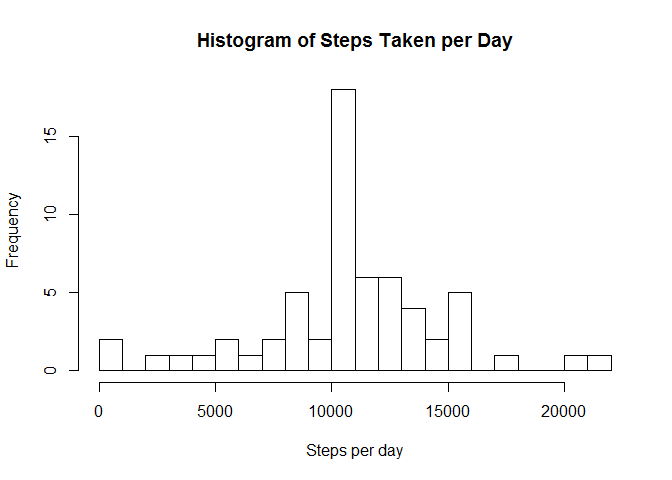

# Reproducible Research: Peer Assessment 1


## Loading and preprocessing the data


```r
library(data.table)
activityData <- read.csv("activity.csv", stringsAsFactors = FALSE)
activityData$date <- as.POSIXct(activityData$date)
activityData <- data.table(activityData)
```


## What is mean total number of steps taken per day?


```r
stepsTotalsByDay <- activityData[!is.na(steps), sum(steps), by = date]
```


```r
hist(stepsTotalsByDay$V1, xlab = "Steps per day", breaks = 20, 
     main = "Histogram of Steps Taken per Day")
```

\

The mean number of steps per day is: **10766.19** 
and the median number of steps per day is: **10765**.

## What is the average daily activity pattern?


```r
stepsTotalsByTimeInterval <- activityData[!is.na(steps), mean(steps), by = interval]
plot(stepsTotalsByTimeInterval$interval, stepsTotalsByTimeInterval$V1, 
     main = "Average Steps per Time Interval", xlab = "Interval", ylab = "Number of Steps",
     type = "l")
```

\

```r
maximumNumberOfSteps <- max(stepsTotalsByTimeInterval$V1)
intervalOfMaximum <- stepsTotalsByTimeInterval[stepsTotalsByTimeInterval$V1 == maximumNumberOfSteps, ]$interval
```

The maximum average number of steps per interval (**206.1698113**) occurs 
in the interval: **835**.


## Imputing missing values

The total number of intervals with NA in the steps column is: **2304**.

In order to handle NA values we will replace all intervals with NA in the steps column with
the mean number of steps for that interval rounded to the nearest integer.


```r
activityDataWithoutNAs <- activityData
for (i in 1:nrow(activityDataWithoutNAs))
{
    if(is.na(activityDataWithoutNAs[i,]$steps)){
        activityDataWithoutNAs[i,]$steps <- 
        as.integer(round(stepsTotalsByTimeInterval[stepsTotalsByTimeInterval$interval == 
                                                       activityDataWithoutNAs[i,]$interval]$V1))
    }
}
```


```r
stepsTotalsByDayWithMissingImputed <- activityDataWithoutNAs[, sum(steps), by = date]
```


```r
hist(stepsTotalsByDayWithMissingImputed$V1, xlab = "Steps per day", breaks = 20, 
     main = "Histogram of Steps Taken per Day")
```

\

The mean number of steps per day when the missing data is imputed is: **10765.64** 
and the median number of steps per day is: **10762**.

As can be seen by comparing to the figures for mean and median above imputing data from the existing data can affect the analysis of the mean and median.

## Are there differences in activity patterns between weekdays and weekends?


```r
activityDataWithWeekdays <- activityDataWithoutNAs
activityDataWithWeekdays$Day <- factor(ifelse(weekdays(activityDataWithWeekdays$date) %in% c("Saturday", "Sunday"),"weekend", "weekday"))

activityMeans <- activityDataWithWeekdays[, mean(steps), by = list(interval, Day)]

library(lattice)
xyplot(V1 ~ interval | Day, data = activityMeans, layout = c(1,2), ylab = "Number of steps", xlab = "Interval", type = "l")
```

\
