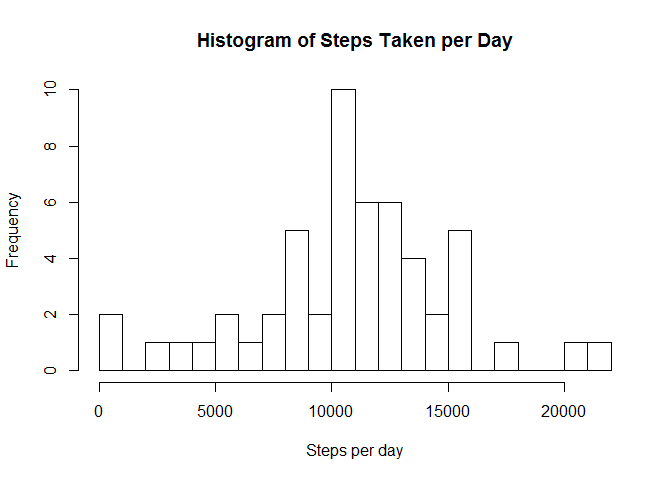
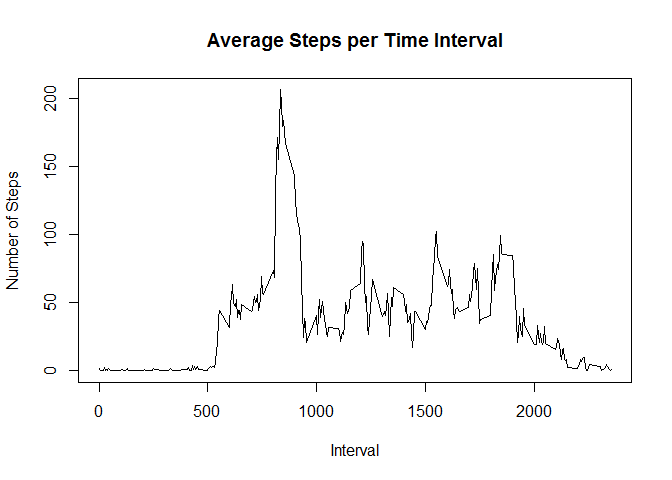

# Reproducible Research: Peer Assessment 1


## Loading and preprocessing the data


```r
library(data.table)
```

```
## Warning: package 'data.table' was built under R version 3.2.3
```

```r
activityData <- read.csv("activity.csv", stringsAsFactors = FALSE)
activityData$date <- as.POSIXct(activityData$date)
activityData <- data.table(activityData)
```


## What is mean total number of steps taken per day?


```r
stepsTotalsByDay <- activityData[!is.na(steps), sum(steps), by = date]
```


```r
hist(stepsTotalsByDay$V1, xlab = "Steps per day", breaks = 20, 
     main = "Histogram of Steps Taken per Day")
```

\

The mean number of steps per day is: 10766.19 
and the median number of steps per day is: 10765.

## What is the average daily activity pattern?


```r
stepsTotalsByTimeInterval <- activityData[!is.na(steps), mean(steps), by = interval]
plot(stepsTotalsByTimeInterval$interval, stepsTotalsByTimeInterval$V1, 
     main = "Average Steps per Time Interval", xlab = "Interval", ylab = "Number of Steps",
     type = "l")
```

\

```r
maximumNumberOfSteps <- max(stepsTotalsByTimeInterval$V1)
intervalOfMaximum <- stepsTotalsByTimeInterval[stepsTotalsByTimeInterval$V1 == maximumNumberOfSteps, ]$interval
```

The maximum average number of steps per interval (206.1698113) occurs 
in the interval: 835.


## Imputing missing values


## Are there differences in activity patterns between weekdays and weekends?
